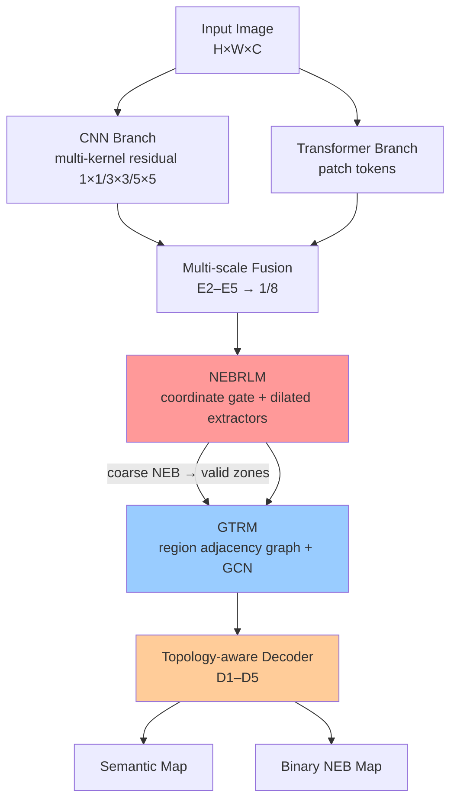

# <h1 align="center">🌍 Top0CoverNet⁺</h1>

# <h3 align="center">Top0CoverNet⁺: Cross-Topology as a Learning Signal for Structurally Consistent Remote Sensing and Natural Image Segmentation</h3>


Fig.1: Conceptual framework of Top0CoverNet+. Left: multi-sensor Earth observation (optical, LiDAR, and radar platforms, UAVs, and ground stations)
provides high-resolution imagery. Top right: conventional pixel-wise mappings Y = f(X) produce land-cover maps from pixel-level predictions. Middle right:
existing methods versus Top0CoverNet+: (a) image; (b) ground truth; (c) baseline prediction with boundary errors; (d) absolute error; (e) edge refinement by
Top0CoverNet+; and (f) high-level semantics. Top0CoverNet+integrates region-level reasoning and geometric constraints to reduce structural errors. Bottom:
representative applications in forest and agricultural monitoring, urbanization, and flood mapping.


<p align="center">
  
  
  
</p>

<p align="center">
  
  
  
  
</p>

<p align="center">
  <strong>✨ Official PyTorch Implementation ✨</strong>
</p>

<p align="center">
  <a href="#-key-features">Key Features</a> •
  <a href="#%EF%B8%8F-architecture">Architecture</a> •
  <a href="#-getting-started">Getting Started</a> •
  <a href="#-datasets">Datasets</a> •
  <a href="#-results">Results</a> •
  <a href="#-citation">Citation</a> •
  <a href="#-contact">Contact</a>
</p>

---

## 📢 Latest News

```diff
+ 🚀 2026: Code released
+ 📝 2026: Manuscript submitted to IEEE Transactions on Geoscience and Remote Sensing
+ 🎉 2026: Top0CoverNet (conference version) accepted at IGARSS 2026
```

---

## 👥 Authors

**Boaz Mwubahimana**¹ · Graduate Student Member, IEEE  
**Dingruibo Miao**¹ · *Corresponding Author*  
**Yan Jianguo**¹² · *Corresponding Author*  
**Jian Song**³ · Member, IEEE  
**Le Ma**¹ · Member, IEEE  
**Dalei Hao**⁴  
**Ruisheng Wang**⁵ · Senior Member, IEEE  
**Swalpa Kumar Roy**⁶ · Senior Member, IEEE  
**Hongruixuan Chen**³ · Member, IEEE

### 🏛️ Affiliations

1. **State Key Laboratory of Information Engineering in Surveying, Mapping and Remote Sensing (LIESMARS)**, Wuhan University, China
2. **Xinjiang Astronomical Observatory**, Chinese Academy of Sciences, China
3. **The University of Tokyo**, Japan
4. **School of Resource and Environmental Sciences**, Wuhan University, China
5. **School of Architecture and Urban Planning**, Shenzhen University, China
6. **Department of Computer Science and Engineering**, Tezpur University, India

📧 **Corresponding Authors**: Dingruibo Miao ([miaodrb@whu.edu.cn](mailto:miaodrb@whu.edu.cn)) · Yan Jianguo ([jgyan@whu.edu.cn](mailto:jgyan@whu.edu.cn))

---

## 📖 Abstract

<div align="center">


</div>

<br>


A segmentation map can be correct at nearly every pixel and still be unusable: parcels fragment into
disconnected pieces, boundaries drift from the true outline, and shapes become implausible. The cause is the
training objective — a pixel-decomposable loss is invariant to any rearrangement of correctly classified
pixels. **Top0CoverNet⁺** formulates high-resolution segmentation as a **topology-aware learning problem**
that jointly infers semantics and binary **nodal edges and boundaries (NEB)**, and places region-level
structure inside the gradient path.

### 🔑 Key Innovation

- **NEBRLM**: direction-factorised gating that preserves *where* an edge response occurs, with multi-dilation edge extractors
- **GTRM**: a region adjacency graph over **valid zones**, rebuilt at every forward pass, at `O(N·k)` instead of `O(N²)` cost
- **GAOO**: one differentiable objective supervising classes, NEB, connectivity (persistent homology) and compactness

---

## 🎯 Key Features

| Failure mode | Detected by | Remedy | Supervising loss |
|---|---|---|---|
| 🧩 Fragmentation | Gap ratio (GR ↓) | GTRM | `L_topo` |
| 📐 NEB drift | Boundary F1 (BF1 ↑) | NEBRLM | `L_edge^bin` |
| 🔷 Shape implausibility | Compactness (CP ↑) | GAOO | `L_compact` |

### 🏆 Performance Highlights (sKwanda_V2)

| Metric | Top0CoverNet⁺ | Strongest baseline | Baseline |
|---|---|---|---|
| 📊 mIoU (%) | **72.6** | 72.1 | Prithvi-EO-2.0 |
| 📐 BF1 | **0.694** | 0.659 | UNetFormer |
| 🔷 CP | **0.762** | 0.654 | Prithvi-EO-2.0 |
| 🧩 GR ↓ | **0.062** | 0.106 | Prithvi-EO-2.0 |
| 🔢 Params (M) | **24.3** | 28.5 | TopoRF-Net |
| ⚡ Inference (ms, A100, 512²) | **18.9** | 40.2 | BRIDGE-LC |

---

## 🏗️ Architecture


Fig.2: Overview of Top0CoverNet+. Input high-resolution imagery; dual-branch CNN–ViT encoder; NEBRLM; GTRM over valid zones; multi-scale fusion;
decoder emitting semantic and NEB maps. Shaded path marks the gradient route.




### 🧩 Core Components

<details>
<summary><b>1️⃣ Dual-Branch Encoder</b> (<code>top0covernet/models/encoder.py</code>)</summary>

- `MultiKernelResidualBlock` — Eq. (3): `R(C₁ₓ₁ ⊕ C₃ₓ₃ ⊕ C₅ₓ₅)` with kernel proportions `(1, 1/2, 1/4)`
- `TransformerBranch` — Eq. (4): pre-LN transformer over patch tokens
- `DualBranchEncoder` — fuses tokens into E4/E5; `mode="cnn"` / `"vit"` give the encoder ablations
</details>

<details>
<summary><b>2️⃣ NEBRLM</b> (<code>top0covernet/models/nebrlm.py</code>)</summary>

```
g      = σ(F₁([Zʰ ; Zʷ]))                 # Eq. (5): pooled separately along h and w
F_edge = Σ_{s∈{1,2,4}} g ⊙ E_s(F)           # Eq. (6)
```
The NEB head on `F_edge` defines the valid zones used by GTRM.
</details>

<details>
<summary><b>3️⃣ GTRM</b> (<code>top0covernet/models/gtrm.py</code>)</summary>

1. Coarse semantic logits; valid zones `V = {p : σ(b̂ᶜ_p) < 0.3}`
2. Regions = 4-connected single-class components inside `V` (components < 16 px merged into the neighbour with the longest shared boundary)
3. Edges between 4-adjacent regions — NEB pixels are excluded from all regions, so agreement is never enforced across a predicted boundary
4. Node features = `[AvgPool ‖ MaxPool]` over each region; symmetric-normalised GCN (Eq. 7); scatter back to pixels

Region formation is discrete; gradients flow through pooling, GCN weights and the scatter.
</details>

<details>
<summary><b>4️⃣ GAOO</b> (<code>top0covernet/losses/losses.py</code>)</summary>

```
L_total = L_CE + 0.5·L_edge^bin + 0.3·L_topo + 0.2·L_compact
```
- `BinaryNEBLoss` — weighted BCE, positive weight `w = 8`
- `PersistentHomologyLoss` — Hu et al. (NeurIPS 2019) diagram matching, computed with GUDHI
- `CompactnessLoss` — `1 − 4πA/P²` from soft class maps over present classes
</details>

---

## 📊 Datasets

| Dataset | Resolution | Images | Classes | View | Role |
|---|---|---|---|---|---|
| 🌾 **sKwanda_V2** (Rwanda + USA) | 0.3–1.07 m | 2,200 | 8 | Plan (aerial) | Primary; ablation reference |
| 🏙️ **Dubai** | 0.31–2.4 m | 1,500 | 5 | Plan (aerial) | Urban rectilinear footprints |
| 🌐 **OpenEarthMap** | 0.25–0.5 m | 5,000 | 8 | Plan (aerial/satellite) | Cross-continental generalisation |
| 🚗 **Cityscapes** | 1024×2048 px | 5,000 | 30 | Ground-level | Cross-view test |

sKwanda_V2 covers five Rwandan districts (Kigali, Bugesera, Nyagatare, Kamonyi, Rwamagana) and NAIP tiles over
Oklahoma, Virginia, Maryland and Delaware.

### 📥 Download

<p align="center">
<a href="https://drive.google.com/file/d/1X_Fz7LQIeix3rV3K29FBfKiU1WMdROe-/view?usp=drive_link">

</a>
</p>

Pretrained weights will be released upon publication.

### 📁 Data Layout

```
data/sKwanda_V2/
├── raw/{images,labels}/          # full scenes
├── patches/{images,labels}/      # produced by tools/make_patches.py
└── splits/fold{k}_{train,val,test}.txt
```

---

## 🚀 Getting Started

### ⚙️ Installation

```bash
git clone https://github.com/BoazGithub/Top0CoverNet.git
cd Top0CoverNet
conda create -n top0covernet python=3.10 -y
conda activate top0covernet
pip install torch torchvision --index-url https://download.pytorch.org/whl/cu121   # pick your CUDA
pip install -r requirements.txt
```

### 📦 Prepare Patches and Folds

512×512 patches with 50% overlap; all patches of a geographic block are kept in the same split
(70/15/15, five folds) to prevent spatial leakage:

```bash
python tools/make_patches.py --images data/sKwanda_V2/raw/images --labels data/sKwanda_V2/raw/labels \
    --out data/sKwanda_V2/patches --splits data/sKwanda_V2/splits
```

---

## 🎓 Training

```bash
python train.py --config configs/top0covernet_skwanda.yaml
python train.py --config configs/top0covernet_skwanda.yaml --opts data.fold=1           # another fold
python train.py --config configs/top0covernet_skwanda.yaml --resume work_dirs/top0covernet_skwanda/last.pth
```

Defaults follow the paper: AdamW (β = 0.9/0.999, weight decay 0.01), learning rate 1e-3 decayed by 0.95 every
10 epochs (floor 1e-5), batch size 16, 200 epochs, early stopping with patience 20 on validation mIoU.

### 🔬 Reproducing the Ablations

Every ablation is a command-line override:

| Ablation | Override |
|---|---|
| Kernel proportion `(1:1/4:1/16)` | `model.kernel_proportion=[1,0.25,0.0625]` |
| Equal proportions `(1:1:1)` | `model.kernel_proportion=[1,1,1]` |
| `L_CE` only | `model.use_nebrlm=false model.use_gtrm=false loss.lambda_edge=0 loss.lambda_topo=0 loss.lambda_compact=0` |
| NEBRLM + `L_CE` | `model.use_gtrm=false loss.lambda_topo=0 loss.lambda_compact=0` |
| Avg / Max node pooling | `model.node_pooling=avg` / `model.node_pooling=max` |
| Graph from last layer | `model.graph_source=last` |
| w/o GTRM | `model.use_gtrm=false` |
| w/o NEBRLM | `model.use_nebrlm=false` |
| w/o GAOO | `loss.lambda_topo=0 loss.lambda_compact=0` |
| CE only / TE only | `model.encoder_mode=cnn` / `model.encoder_mode=vit` |

---

## 🧪 Evaluation & Inference

```bash
# Semantic (OA, mIoU, F1, FWIoU, Kappa) and structural (BF1, CP, GR) metrics
python test.py --config configs/top0covernet_skwanda.yaml --checkpoint work_dirs/top0covernet_skwanda/best.pth

# Large-scene mapping with Hann-blended overlapping tiles (GeoTIFF output if rasterio is installed)
python inference.py --config configs/top0covernet_skwanda.yaml --checkpoint work_dirs/top0covernet_skwanda/best.pth \
    --input scene.tif --output results/scene --tile 512 --overlap 0.5

# Parameters, FLOPs and latency (FP32, batch 1, 512², 100 runs after 10 warm-up)
python benchmark.py --config configs/top0covernet_skwanda.yaml
```

For cross-dataset transfer, evaluate a source checkpoint with the target dataset's config and set
`data.class_map` to map source labels to the harmonised schema.

### 🐍 Python API

```python
import torch
from top0covernet import build_model
from top0covernet.utils import Config

cfg = Config.from_yaml("configs/top0covernet_skwanda.yaml")
model = build_model(cfg.model).eval()
out = model.predict(torch.rand(1, 3, 512, 512))
out["label"].shape, out["neb_prob"].shape   # (1, 512, 512), (1, 512, 512)
```

---

## 📊 Results


Fig.3: Feature responses learned by Top0CoverNet+ on sKwanda V2. (a) Built-up scene; (b) road-interchange scene. Rows, top to bottom: input coarse
map; CNN-branch responses at kernel sizes 1×1, 3×3, and 5×5 (Eq. (3)); NEBRLM directional responses, with the binary NEB map in (a8) and (b8);
multi-scale edge responses fused into the final NEB response (Eq. (6)). As the scale index increases, the response concentrates along parcel and building
outlines rather than across region interiors.


Fig.4: Bottleneck representation of Top0CoverNet+ on Cityscapes. (a) Image; (b)–(c) mean E5 activation (3×8×512); (d) road probability; (e)–(g) top-3
channels; (h) overlay. Dominant channels respond to the coherent road region rather than isolated pixels.
### 🏆 Comparison on sKwanda_V2

| Family | Method | OA (%) | mIoU (%) | BF1 | CP | GR ↓ | Params (M) | FLOPs (G) | Inf. (ms) |
|---|---|---|---|---|---|---|---|---|---|
| Foundation | LandSegmenter | 78.6 | 71.8 | 0.654 | 0.650 | 0.108 | 46.8 | 62.4 | 52.6 |
| Foundation | Prithvi-EO-2.0 | 79.1 | 72.1 | 0.658 | 0.654 | 0.106 | 52.3 | 72.4 | 62.8 |
| Coarse-to-fine | C2FNet | 76.2 | 70.1 | 0.648 | 0.640 | 0.120 | 36.2 | 65.7 | 54.6 |
| Coarse-to-fine | FWDNNet | 76.4 | 70.4 | 0.652 | 0.644 | 0.118 | 35.0 | 63.8 | 53.4 |
| Graph/Topology | SAGRNet | 77.1 | 70.8 | 0.652 | 0.646 | 0.116 | 38.4 | 68.7 | 52.4 |
| Mamba/Hybrid | FMTUNet | 78.4 | 71.2 | 0.648 | 0.644 | 0.118 | 38.2 | 56.4 | 42.8 |
| Transformer | UNetFormer | 76.2 | 70.0 | 0.659 | 0.642 | 0.120 | 38.2 | 67.3 | 68.2 |
| **Ours** | **Top0CoverNet⁺** | **79.8** | **72.6** | **0.694** | **0.762** | **0.062** | **24.3** | 56.4 | **18.9** |

### 🌍 Across Benchmarks (mIoU % / GR)

| Method | sKwanda_V2 | Dubai | OpenEarthMap | Cityscapes |
|---|---|---|---|---|
| Prithvi-EO-2.0 | 72.1 / 0.106 | 71.4 / 0.110 | 68.0 / 0.130 | 70.4 / 0.138 |
| **Top0CoverNet⁺** | **72.6 / 0.062** | **72.0 / 0.070** | **68.7 / 0.086** | **71.2 / 0.094** |

### 💡 Structural-Component Ablation (sKwanda_V2)

| Configuration | mIoU (%) | BF1 | CP |
|---|---|---|---|
| Full model | **72.6** | **0.694** | **0.762** |
| w/o GAOO | 71.4 | 0.676 | 0.726 |
| w/o GTRM | 70.8 | 0.668 | 0.712 |
| w/o NEBRLM | 69.2 | 0.642 | 0.712 |
| No structural component | 68.5 | 0.635 | 0.618 |

Numbers are those reported in the paper. Retrained results may differ with hardware, data version and seed.

---

## 🗂️ Repository Structure

```
Top0CoverNet/
├── configs/top0covernet_skwanda.yaml
├── top0covernet/
│   ├── models/      encoder.py · nebrlm.py · gtrm.py · decoder.py · top0covernet.py
│   ├── losses/      losses.py (BinaryNEBLoss, PersistentHomologyLoss, CompactnessLoss, GAOOLoss)
│   ├── data/        dataset.py (LandCoverDataset, NEBTargetGenerator, Augmentor) · tiling.py
│   ├── metrics/     metrics.py (SegmentationMetrics, StructuralMetrics)
│   ├── engine/      trainer.py · evaluator.py · predictor.py
│   └── utils/       config.py · misc.py
├── tools/make_patches.py
├── train.py · test.py · inference.py · benchmark.py
└── requirements.txt
```

### 📝 Implementation Notes

- **Deep supervision.** The coarse semantic and NEB heads that define GTRM's regions and valid zones receive an
  auxiliary loss (`loss.aux_weight`, default 0.4). Set it to 0 to train with Eq. (8) alone.
- **Topological loss cost.** Persistence diagrams are computed on CPU with GUDHI on class maps resized to
  `loss.topo_size` (default 64×64), for each class present in an image.
- **Compactness.** A pixelised square scores π/4 under `4πA/P²`, so the compactness term acts as a prior and
  never reaches zero; it is unsuitable for elongated classes (see the limitations in the paper).

---

## 🙏 Acknowledgments

This work was supported by the National Natural Science Foundation of China (Nos. 42241116, 42402230) and the
National Key Research and Development Program of China (No. 2022YFF0503202). We thank the providers of the
Dubai and OpenEarthMap benchmarks and acknowledge the support of LIESMARS, Wuhan University.

---

## 📝 Citation

The paper is under review; a full BibTeX entry will be added upon publication.

```bibtex
@article{mwubahimana2026top0covernetplus,
  author  = {Mwubahimana, Boaz and Miao, Dingruibo and Jianguo, Yan and Song, Jian and Ma, Le and
             Hao, Dalei and Wang, Ruisheng and Roy, Swalpa Kumar and Chen, Hongruixuan},
  title   = {Top0CoverNet$^+$: Cross-Topology as a Learning Signal for Structurally Consistent
             Remote Sensing and Natural Image Segmentation},
  journal = {IEEE Transactions on Geoscience and Remote Sensing},
  note    = {Under review},
  year    = {2026}
}
```

### 📚 Related Publications

```bibtex
@ARTICLE{11579418,
  author={Mwubahimana, Boaz and Miao, Dingruibo and Jianguo, Yan and Ma, Le and Dukundane, Remy and Huang, Xiao and Roy, Swalpa Kumar and Wang, Ruisheng},
  journal={IEEE Transactions on Geoscience and Remote Sensing}, 
  title={TagParaFormer: Cross-Hybrid Attention Learning Framework for Topology-Aware Road Network Extraction From Remote Sensing Imagery}, 
  year={2026},
  volume={64},
  number={},
  pages={5630917-5630917},
  keywords={Roads;Modeling;Convolutional neural networks;Topology;Optimization;Pixel;Remote sensing;Modules (abstract algebra);Accuracy;Educational institutions;Bayesian optimization;convolutional neural networks (CNNs);graph attention network;remote sensing (RS);road network extraction;topology-preserving segmentation;vision transformer (ViT)},
  doi={10.1109/TGRS.2026.3707401}}


@ARTICLE{11343844,
  author={Mwubahimana, Boaz and Jianguo, Yan and Miao, Dingruibo and Roy, Swalpa Kumar and Li, Zhuohong and Ma, Le and Kagoyire, Clarisse and Guo, Haonan and Mugabowindekwe, Maurice and Nyandwi, Elias and Nzayisenga, Isaac and Athanase, Hafashimana and Maridadi, Eugene and Nsengiyumva, Jean Baptiste and Byukusenge, Elie and Dukundane, Remy and Rwanyiziri, Gaspard and Huang, Xiao},
  journal={IEEE Transactions on Geoscience and Remote Sensing}, 
  title={FWDNNet: Cross-Heterogeneous Encoder Fusion via Feature-Level TensorDot Operations for Land-Cover Mapping}, 
  year={2026},
  volume={64},
  number={},
  pages={1-19},
  keywords={Remote sensing;Transformers;Computer architecture;Feature extraction;Semantic segmentation;Computational modeling;Computational efficiency;Semantics;Land surface;Faces;Convolutional neural network (CNN)-to-token conversion;deep learning;remote sensing (RS) segmentation;TensorDot fusion},
  doi={10.1109/TGRS.2026.3652451}}


@ARTICLE{11124258,
  author={Mwubahimana, Boaz and Jianguo, Yan and Miao, Dingruibo and Li, Zhuohong and Guo, Haonan and Ma, Le and Mugabowindekwe, Maurice and Roy, Swalpa Kumar and Huang, Xiao and Nyandwi, Elias and Joseph, Tuyishimire and Habineza, Eric and Mwizerwa, Fidele and Athanase, Hafashimana and Rwanyiziri, Gaspard},
  journal={IEEE Transactions on Geoscience and Remote Sensing}, 
  title={C2FNet: Cross-Probabilistic Weak Supervision Learning for High-Resolution Land Cover Enhancement}, 
  year={2025},
  volume={63},
  number={},
  pages={1-30},
  keywords={Spatial resolution;Remote sensing;Land surface;Weak supervision;Training;Feature extraction;Annotations;Image resolution;Noise measurement;Earth;Coarse-to-fine networks (C2FNets);cross-resolution learning;deep neural networks;Earth observation;land cover mapping;probabilistic supervision;remote sensing;weakly supervised learning (WSL)},
  doi={10.1109/TGRS.2025.3598681}}

```

---

## 📞 Contact

- **Boaz Mwubahimana**: [m.boaz@whu.edu.cn](mailto:m.boaz@whu.edu.cn) · [aiboaz1896@gmail.com](mailto:aiboaz1896@gmail.com)
- **Dingruibo Miao**: [miaodrb@whu.edu.cn](mailto:miaodrb@whu.edu.cn)
- **Yan Jianguo**: [jgyan@whu.edu.cn](mailto:jgyan@whu.edu.cn)

Questions and bug reports: please open an [issue](https://github.com/BoazGithub/Top0CoverNet/issues).

---

## 📄 License

Released for non-commercial research use. For commercial applications, please contact the corresponding
authors.

<div align="center">

**If you find this work helpful, please consider giving us a ⭐!**

</div>
